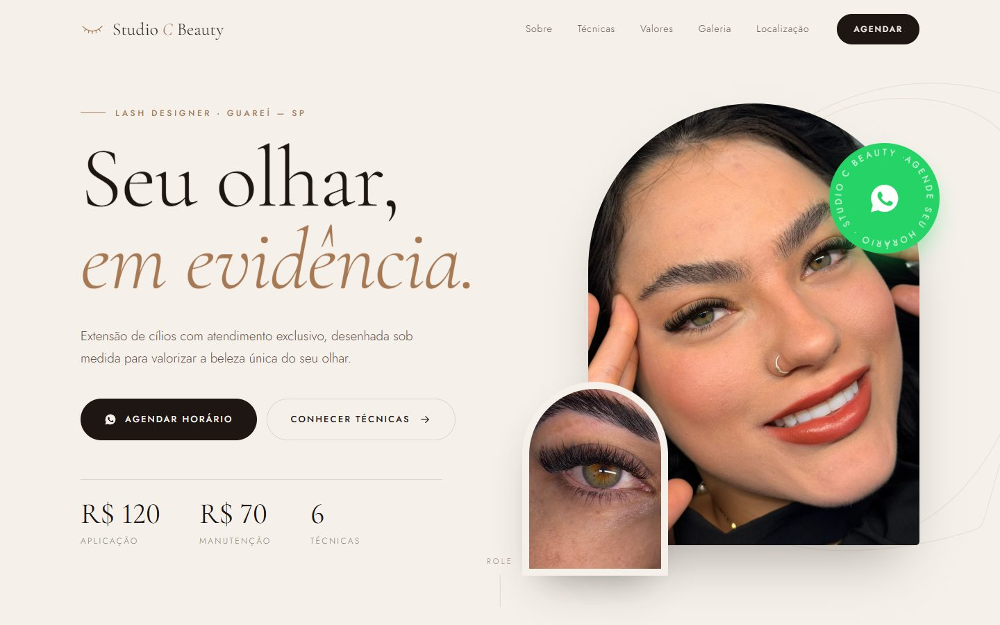

<div align="center">


# Studio C Beauty

**Landing page da Cássia, Lash Designer em Guareí - SP**

[](https://www.studiocbeauty.com.br/)
[](https://www.instagram.com/studiocbeauty_/)
[](https://pages.github.com/)

[**Acessar o site →**](https://www.studiocbeauty.com.br/)

</div>

<p align="center">
  
  &nbsp;
  
</p>

## Sobre

Site institucional do **Studio C Beauty**, especializado em extensão de cílios. A página apresenta as técnicas (Volume Ruby, Brasileiro, Egípcio, Fox, Luxo e Aurora) com fotos por cor de fio, valores, galeria de trabalhos, perguntas frequentes e localização. Todo o agendamento é feito pelo WhatsApp, com mensagem já preenchida.

### Destaques

- **Design editorial e responsivo**, pensado primeiro para o celular.
- **Animações suaves** com GSAP + ScrollTrigger e rolagem com Lenis, que respeitam `prefers-reduced-motion`.
- **Funciona sem JavaScript de animação**: menu, seletor de técnicas, FAQ, galeria e links de WhatsApp continuam operando se as bibliotecas não carregarem.
- **SEO local**: meta tags, Open Graph, dados estruturados `BeautySalon` (JSON-LD), `sitemap.xml` e `robots.txt`.
- **Sem build**: HTML, CSS e JavaScript puros, publicados direto do branch `main`.

## Tecnologias

| | |
|---|---|
| Marcação e estilo | HTML5, CSS3 (custom properties, grid, `clip-path`) |
| Interações | JavaScript (ES2015+, sem framework) |
| Animação | [GSAP 3](https://gsap.com/) + ScrollTrigger · [Lenis](https://lenis.darkroom.engineering/) (via CDN jsDelivr) |
| Tipografia | Cormorant Garamond e Jost (Google Fonts) |
| Hospedagem | GitHub Pages com domínio próprio e HTTPS |

## Estrutura

```
.
├── index.html            conteúdo, SEO e dados estruturados
├── 404.html              página de erro personalizada
├── assets/
│   ├── css/style.css     estilos (tokens de cor e fonte em :root)
│   ├── js/main.js        interações e animações
│   └── favicon.svg
├── images/               fotos (nomes em minúsculas, sem espaço/acento)
├── robots.txt
├── sitemap.xml
└── CNAME                 domínio www.studiocbeauty.com.br
```

## Rodando localmente

Não há dependências para instalar. Basta abrir o `index.html` no navegador ou, para simular o servidor:

```bash
python -m http.server 8000
# http://localhost:8000
```

## Publicação

O site é publicado automaticamente pelo **GitHub Pages** a cada push no branch `main` (Settings → Pages → *Deploy from a branch* → `main` / `root`). O domínio `www.studiocbeauty.com.br` é definido no arquivo `CNAME`, com HTTPS obrigatório.

As URLs absolutas (`canonical`, `og:url`, `og:image`, JSON-LD e `sitemap.xml`) apontam para esse domínio. Se ele mudar, atualize esses pontos.

## Editando o conteúdo

| O que | Onde |
|---|---|
| Número do WhatsApp | constante `WHATSAPP` em `assets/js/main.js` |
| Botões de agendamento | elementos com `class="wa-link"` e `data-msg="mensagem"` (o link é gerado pelo JS) |
| Valores | `.hero__meta` e seção `#precos` no `index.html`, e `makesOffer` no JSON-LD |
| Técnicas | cada `<li class="tech">`, com `data-images` contendo as fotos por cor de fio (`preto` / `marrom`) |
| Galeria | blocos `<figure class="shot">` (sempre informe `width`/`height` reais da imagem) |

## Direitos

© Studio C Beauty. Todos os direitos reservados. As fotos e a identidade visual pertencem ao Studio C Beauty e não podem ser reutilizadas sem autorização.
